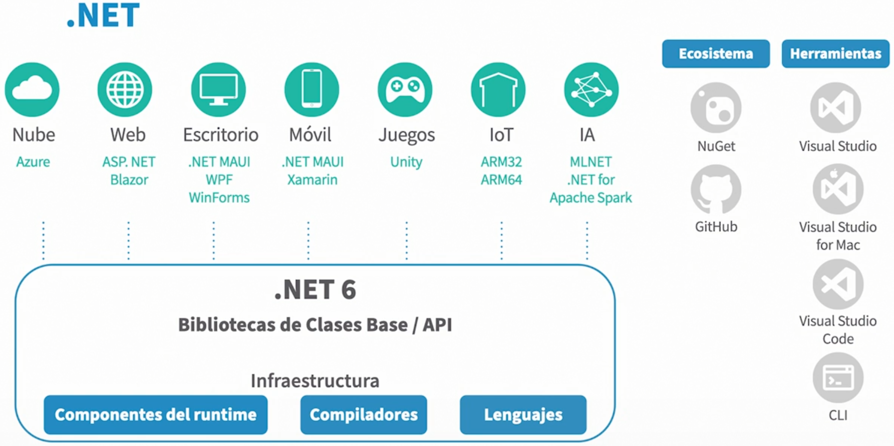
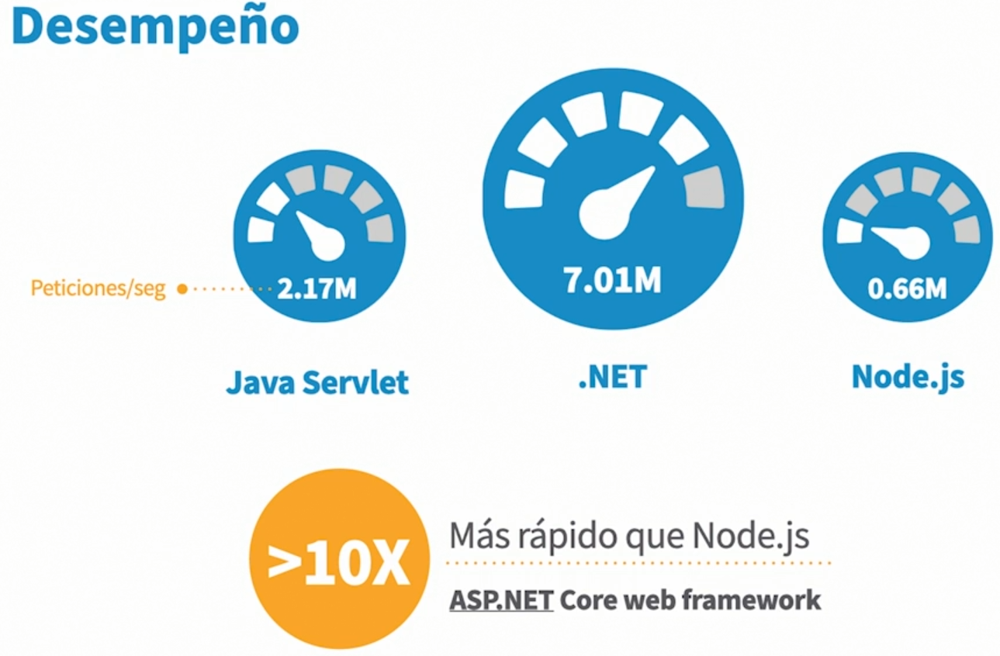

[![Github][github-shield]][github-url]
[![Kofi][kofi-shield]][kofi-url]
[![LinkedIn][linkedin-shield]][linkedin-url]

# ¿Que es .NET 6?

- Es la unificación de todos los DOTNET que tenemos al alcance desde ya hace varios años.
- Comenzo con: DOTNET Standart, DOTNET Core, DOTNET 5 y ahora DOTNET 6.

## Calendario de .NET

- Noviembre 2020: .NET 5.0 GA (General Availability)
- Noviembre 2021: .NET 6.0 LTS (Long Term Support)
- Noviembre 2022: .NET 7.0 GA
- Noviembre 2023: .NET 8.0 LTS

## Desempeño

<!--- reference style links --->
[github-shield]: https://img.shields.io/badge/-@fernandocalmet-%23181717?style=flat-square&logo=github
[github-url]: https://github.com/fernandocalmet
[kofi-shield]: https://img.shields.io/badge/-@fernandocalmet-%231DA1F2?style=flat-square&logo=kofi&logoColor=ff5f5f
[kofi-url]: https://ko-fi.com/fernandocalmet
[linkedin-shield]: https://img.shields.io/badge/-fernandocalmet-blue?style=flat-square&logo=Linkedin&logoColor=white&link=https://www.linkedin.com/in/fernandocalmet
[linkedin-url]: https://www.linkedin.com/in/fernandocalmet