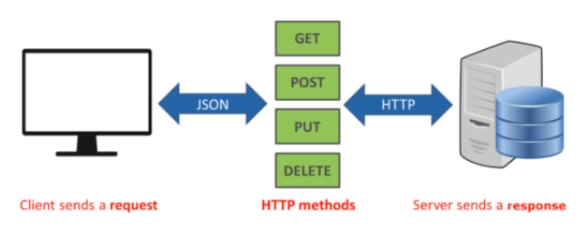
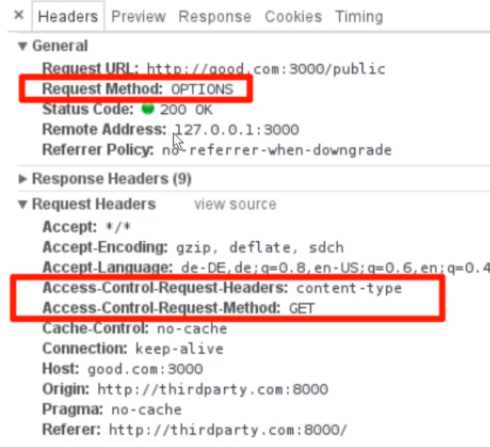
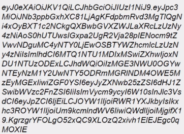
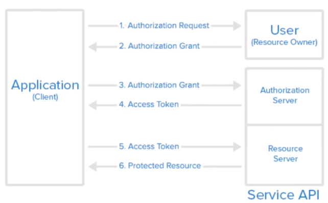

[![Github][github-shield]][github-url]
[![Kofi][kofi-shield]][kofi-url]
[![LinkedIn][linkedin-shield]][linkedin-url]

# DISEÑO DE UNA API

# Introducción

## ¿Que es una API?

- Application Programming Interface.
- Funcionalidades que nos ofrece un tercero para interactuar con ella a través de una capa de abstracción

## Ejemplos de una API

- Una librería para generar archivos PDF.
- Librerías para realizar pagos a través de PayPal.
- RESTful APIs.

## REST

- Es una **arquitectura propuesta** para crear servicios sobre HTTP.
- Propuesta por **Roy Fielding** en los años 2000.

## RESTFul

Es la implementación de la arquitectura propuesta sobre servicios HTTP.

## Que es una API RESTFul

Es una interfaz abstracta para generar comunicación a través de los servicios HTTP.

## Por qué implementar una RESTFul API

Facilita la escalabilidad y el acceso a los datos.

## Ventajas

- Facilita el escalamiento
- Desacopla tu cliente
- Promueve la comunicación entre diversas tecnologías
- Reduce los consumos del servidor
- Uniformiza tu proyecto

## Desventajas

- Eleva el desarrollo
- Requiere mayor esfuerzo de pruebas

# Recursos

Los recursos son URIs para acceder a la manipulación o lectura de nuestra API.

*Ejemplo:*

- `api.khanakat.com/users`
- El recurso es el usuario "**/users**".
- La URL completa se conoce como **endpoint**.

## Como escribir un buen recurso

- Sustantivos, no usar verbos
- Deben ser plurales

## Lo correcto

- `api.khanakat.com/orders`
- `api.khanakat.com/orders/1`

## Lo que no debemos hacer

- `api.khanakat.com/orders/getAll`
- `api.khanakat.com/orders/getById`

## Como acceder a un recurso

**Método** | **URL**
--- | ---
GET | api.khanakat.com/users
GET | api.khanakat.com/users/2
POST | api.khanakat.com/users
PUT | api.khanakat.com/users/2
DELETE | api.khanakat.com/users/2

## HTTP REQUEST

- Un request es una **petición**.
- Queremos **solicitar** algo a nuestra API.
- Un **HTTP REQUEST** es una petición que hace uso del protocol **HTTP**.

### Partes de un REQUEST

**Header** | **Body** | **QueryString**
--- | --- | ---
Información de metadata como la IP del usuario User Agent, información del Token. | Información relevante para nuestra API ya que es lo que va a manipular y lo más común es mandarla en formato JSON. `{"username: "fcalmet", "password": "123456"}` | Información que forma parte de la URL como parámetros. `api.khanakat.com/users?orderBy=creationDate`

## HTTP RESPONSE

- Es una **RESPUESTA**.
- Lo que esperamos que **RESPONDA** nuestra API.
- Se acompaña de un **STATUS CODE**.

### Partes de un RESPONSE

**Header** | **Body**
--- | ---

Información de metadata que manda el servicio al cliente. | La respuesta que adjunta el servidor al cliente para complacer su REQUEST. `{ "id": 1, "name": "Fernando", ... }`

### RESPONSE Status Code

- La respuesta están acompañadas por un **código de estado**.
- El código de estado nos ofrece información de **como se proceso la información**.

### Algunos casos

- **404**: El recurso no fue encontrado.
- **400**: Bad request.
- **500**: Internal Server error.
- **20x**: Satisfactorios.

# REST

## Recursos

- [Postman](https://www.postman.com/)
- [Req Res](https://reqres.in/)

## Postman

Es un cliente que nos ayuda a realizar **pruebas a nuestra API**.

## Verbo GET

Se usa para la **lectura de un recurso** ya sea una colección un solo registor de este a través de su ID.

**Método** | **URL** | **Status**
--- | --- | ---
GET | https://reqres.in/api/users | 200 (OK)

GET | https://reqres.in/api/users/1 | 200 (OK)

## Verbo POST

Se usa para la creación de un recurso.

**Método** | **URL** | **Body** | **Status**
--- | --- | --- | ---
PUT | https://reqres.in/api/users/1 | {"name": "fernando","job": "leader"} | 200 (OK)

## Verbo PATCH

Se usa para la **actualización parcial de un recurso**.

**Método** | **URL** | **Body** | **Status**
--- | --- | --- | ---
PATCH | https://reqres.in/api/users/1 | {"name": "fernando"} |  200 (OK)

## Verbo DELETE

Se usa para la **eliminación de un recurso**.

**Método** | **URL** | **Status**
--- | --- | ---
DELETE | https://reqres.in/api/users/1 | 204 (No Content)

# Principios

## 1. Uniform interface

- Las interfaces de REST se basa en **recursos**.
- La **representación del recurso** es suficiente para entender como manipular este.



## 2. Client-Server

- El **cliente** y el **servidor** deben de trabajar independientemente (cero acoplamiento).
- El **único medio de comunicación** es nuestra API.

## 3. Stateless

- Nuestra API no **persiste información** entre un REQUEST y RESPONSE.
    - Cookies
    - Variables de sesión

## 4. Cacheable

Para mejorar el performance se puede **CACHEAR** la respuesta del servidor.

- Redis
- Memcache

## 5. Layered System

**API** | **CLIENTE**
--- | ---
Puede usar N servidores  | A nuestro cliente no le interesa esto, el solo debe saber como acceder a los recursos.
Escribir en una base de datos A  
Leer de una base de datos C

## 6. Code on demand

Principio opcional, nuestro **API** puede ayudar o facilitar a nuestro cliente de las siguientes maneras:

- Librerías en JavaScript
- Librerías en una tecnología específica

# Tips y Recomendaciones

## Asociaciones

Se entiende como una sociación a la **relación** de una entidad con otra.

### Ejemplo 1

¿Cuando queremos acceder a los hijos de un recurso?

> api.khanakat.com/users/1/documents

### Ejemplo 2

Y si queremos acceder a un hijo especifico

> api.khanakat.com/users/1/documents/1

## Versionamiento

- Solemos **versionar** cuando queremos implementar mejoras.
- Estos cambios **no deben ocasionar errores** a nuestros clientes.
- La forma más simple y común es a **través de nuestra URI** especificando la versión.

### Ejemplo de versionamiento

`api.khanakat.com/v1/users`

## Swagger

- Son una serie de **reglas**, **especificaciones** que nos permite documentar nuestra API.
- Facilita el **USO** de nuestra API.
- Se suele usar **Swagger UI** el cual implementa una interface visual.

## **Ordenamiento, filtrado, búsqueda y paginación**

- Muchas veces necesitamos **manipular la información** de lectura.
- En vez de crear **endpoints adicionales**, mejor lo hacemos a través de la **QueryString**.

### Ordenamiento

- `users?sort_by=firstName`
- `users?sort_by=firstName:desc`

### Filtrado

- `users?=userId=1,2,3`

### Busqueda

- `users?search=fernando`

### Paginación

- `users?limit=30`
- `users?page=1&take=30`
- Nuestra respuesta debe retorna **información inteligente**
- `{"page":1, "pages": 10, "total": 300, "items": [{user}, {user}, ...]}`

## Manejo de errores

Es usual manejar con 2 tipos de errores

- Los que genera el **cliente**.
- Los que genera **nuestro servidor**.

### Errores del cliente

**Estado** | **Descripción**
--- | --- | ---
400 - Bad Request | Información del cliente no puede ser interpretada
401 - Unauthorized | Acceso no autorizado
403 - Forbidden | Acceso autorizado pero permiso denegado
404 - Not found | Recurso no autorizado

### Errores del servidor

**Estado** | **Descripción**
--- | ---
500 - Internal Server Error | Cuando se producen excepciones no controladas
504 - Gateway Timeout | No puede responder a tiempo a la petición del cliente

## **First Design**

Un error común que cometemos en nuestro diseño es pensar primero en la pantalla y luego en nuestra API.

Lo que se busca es que nuestra API exponga las reglas de negocio y defina lo que se va a satisfacer. De esta manera, si nuestro cliente requiere algo específico, pues será problema de él no nuestro.

### **3 reglas a seguir**

- Tu API es la primera UI de tu aplicación.
- Tu API viene primero, luego es la implementación.
- Tu API describe como se deben hacer las cosas, no el cliente.

El no seguir estos pasos hace que tengamos que llenar nuestra API de endpoints innecesarios haciendo un sistema difícil de mantener.

### **Ejemplo**

### **Cliente**

Necesito un endpoint para traer los cursos agrupados por categoría.

### **API**

No existe ese endpoint pero tenemos uno que te permite traer los cursos filtrados por una categoría.

`Ejemplo: courses?categories=1,2,3,6`

En este caso el cliente tendrá que hacer 2 endpoints, el primero para obtener las categorías, y luego para traer los cursos. El como lo vaya a resolver en su UI es el problema de él, no de nosotros.

### **Conclusión**

Esto puede sonar un poco tedioso, pero si mantenemos estas reglas haremos un diseño más estable y fácil de mantener porque es muy fácil caer en la necesidad de crear endpoints innecesarios solo para satisfacer al cliente.

Imagínate que no solo satisfaces a una aplicación web, sino también a una aplicación mobile. ¿Te imaginas lo exhausto que sería satisfacer al cliente?

# Seguridad

## **CORS**

- Por **seguridad** los navegadores restringen el cruce de información entre dominios distintos.
- Las aplicaciones **SPA** son un ejemplo a través del uso de **AJAX**.
- Nuestra API **Deberá habilitar dichos permisos**.

### **Ejemplo de CORS**

```
> fetch('https://khanakat.com')
    > Promise {<pending>}

Access to fetch at 'https://khanakat.com/' from origin 'chrome-search://local local-ntp.html:1-ntp' has been blocked by CORS policy: No 'Access-Control-Allow-Origin' header is present on the request resource. If an opaque response serves your needs, set the request's mode to 'no-cors' to fetch the resource with CORS disabled.

```

- OPTIONS
- La petición a realizar



## **Autenticación vs Autorización**

### **Authentication**

- La **autenticación** es el proceso por el cual un cliente se identifica ante nuestra API.
- Un mecannismo de autenticación es **Json Web Token**.

### **Authorization**

- Son los **permisos** que tiene el usuario.
- Podemos proteger nuestros recursos **a través de roles**

## **Json Web Token**

Mecanismo de autenticación basada en **TOKEN**.

### **Como funciona**

- El usuario se **autentica** en el sistema.
- Si es correcto, el sistema responde un **token**.



### **Que información contiene el TOKEN**

- El tiempo de **EXPIRACIÓN**.
- **INFORMACIÓN** del usuario como el id, nombre, correo, roles, etc (claims).

### **Como sabe mi API es un usuario válido**

- El cliente deberá mandar el **TOKEN** siempre en el **HEADER** de cada **REQUEST**.
- Nuestra **API** es la única que sabrá como resolver dicho **TOKEN**.

## **OAuth**

- Un **framework** que gestiona la **autorización de los usuarios**.
- Su **versión** más reciente es la 2.

### **Por qué OAUTH**

- Delega la autentación a **terceros**.
- Nos permite tener acceso a la **información del usuario**.
- **Autoriza** el acceso a aplicaciones de terceros.

### **Roles**

- Propietario del recurso
- Cliente
- Servidor de recursos
- Servidor de autorización

### **Propietario del recurso**

El usuario que da **autorización** a una aplicación para que podamos acceder a su cuenta.

### **Cliente**

La aplicación que ha solicitado acceder a la cuenta del usuario.

### **Servidor de recursos**

Vendría la **API** que intentamos acceder a través de los recursos.

### **Servidor de autorización**

El servidor que va a generar el **TOKEN** de acceso.

### **Abstract Protocol Flow**




---
[Regresar al menú principal](https://github.com/FernandoCalmet/dotnet-6-essencial)

<!--- reference style links --->
[github-shield]: https://img.shields.io/badge/-@fernandocalmet-%23181717?style=flat-square&logo=github
[github-url]: https://github.com/fernandocalmet
[kofi-shield]: https://img.shields.io/badge/-@fernandocalmet-%231DA1F2?style=flat-square&logo=kofi&logoColor=ff5f5f
[kofi-url]: https://ko-fi.com/fernandocalmet
[linkedin-shield]: https://img.shields.io/badge/-fernandocalmet-blue?style=flat-square&logo=Linkedin&logoColor=white&link=https://www.linkedin.com/in/fernandocalmet
[linkedin-url]: https://www.linkedin.com/in/fernandocalmet