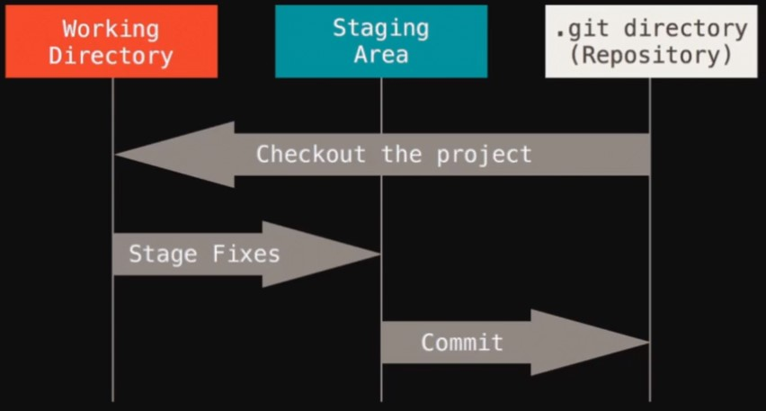
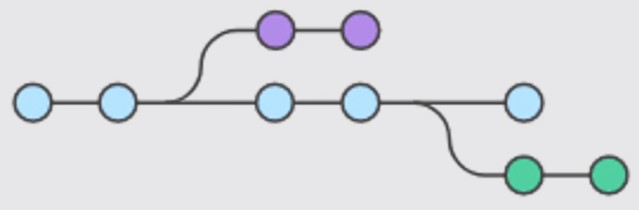

[![Github][github-shield]][github-url]
[![Kofi][kofi-shield]][kofi-url]
[![LinkedIn][linkedin-shield]][linkedin-url]

# Introducción a Git

Aprendizaje de fundamentos del uso de Git y algunas aplicaciones en Github.

## Configuración

Configurar correo de usuario

```bash
git config --global user.email "usuario@email.com"
```

Configurar username de usuario

```bash
git config --global user.name "Fernando"
```

Abrir configuración

```bash
git config --global -e
```

Verificar datos del archivo git

```bash
git config --global -l
```

Listar configuración inicial de git

```bash
git config --list
```

## Estados



## Creación de un repositorio

Crear carpeta

```bash
mkdir primerRepositorio
```

Acceder a la carpeta

```bash
cd primerRepositorio/
```

Crear archivos

```bash
touch home.php
touch contact.php
touch login.php
```

<aside>
💡 Limpiar pantalla **(Ctrl + L)**

</aside>

Iniciar proyecto y autogenerar directorio .git

```bash
git init
```

## Commit

Verificar estado de repositorio

```bash
git status
```

Subir archivos al area de stage

Ingresar un archivo a la vez

```bash
git add home.php
```

Ingresar todos los archivos

```bash
git add .
```

Empaquetar archivos en la rama actual (master)

```bash
git commit -m "Mensaje de primer commit"
```

Crear nuevo archivo y agregarlo al siguiente stage

```bash
touch test.php
git add test.php
git status
```

Verificar modificación de archivos del stage

```bash
git diff
```

Restaurar o deshacer el archivo del stage

```bash
git reset HEAD test.php
```

## Deshaciendo los cambios

Modificar un archivo, ejemplo: el archivo "home.php"

Realizar commit al archivo

```bash
git commit -m "segundo commit"
```

Verificar estado

```bash
git status
```

Deshacer la versión del commit

```bash
git checkout .
```

## Historial de cambios

Listar historial de cambios

```bash
git log
```

## Regresando a una versión especifica

Revisar historial de cambios

```bash
git log
```

Copiar el hash del commit al que se desea volver

ejemplo de hash: 59fc0f91916d8fd2976e5d8599ba8ec13e87dbb2

```bash
git checkout 59fc0f91916d8fd2976e5d8599ba8ec13e87dbb2
```

## Sincronizar de repositorio local a repositorio remoto

Crear archivo y ponerlo en el stage 3

```bash
touch index.php
git init
git status
git add .
git commit -m "iniciando proyecto"
```

Sincronizar repositorio

```bash
git remote add origin https://github.com/fernandocalmet/test.git
```

Sincronizar cambios

```bash
git push -u origin master
```

## Creando una rama (Branch)



Crear archivo en una nueva ramificación

```bash
git branch modificacion
```

Verificar en que rama estamos

```bash
git branch
```

Seleccionar la rama de bifurcasión

```bash
git checkout modificacion
```

Verificar en que rama estamos

```bash
git branch
```

## Fusionando una rama (Merge)

Crear archivo para probar la bifurcación

```bash
touch testing.txt
code testing.txt
git add .
git status
git commit -m "Agregando un mensaje para tener en cuenta"
git status
```

Cambiar de rama (branch) al master

```bash
git checkout master
ls
```

Unir caminos (merge) entre las 2 ramas (branches)

```bash
git merge modificacion
ls
```

Eliminar rama bifurcada

```bash
git branch -d modificacion
```

Verificar cambios

```bash
git branch
```

## Resolviendo conflictos

Crear una nueva rama

```bash
git branch actualizando
```

Ingresar a la rama creada

```bash
git checkout actualizando
```

Revisar listado de archivos

```bash
ls
```

Modificar un archivo

```bash
code index.php
```

Verificar cambios

```bash
git status
```

Subir cambios al stage

```bash
git add .
git commit -m "Se agrego los nuevos cambios del index"
```

Regresar a la rama master

```bash
git checkout master
```

Modificar nuevamente el archivo

```bash
code index.php
```

Enviar modificación al stage

```bash
git add .
git commit -m "Se agregaron lineas adicionales al index"
```

Unir cambios (merge)

```bash
git merge actualizando
```

En este punto salta un conflicto: Conflict (Content): Merge conflict "index.php", Automatic merge failed; fix conflicts and then commit the result.

Seleccionar con cual cambios vamos a escoger, abrir el archivo modificado, y se vera las modificaciones en paralelo , debemos eliminar los cambios no deseados y guardar el archivo.

Subir cambios al stage

```bash
git add .
git commit -m "Solucionando conflicto de index"
git status
```

### Conflicto entre colaboradores:

En el caso que el colaborador realize cambios en un archivo y luego nosotros realizamos otro cambio en el mismo archivo, tras ejecutar el comando: git push origin master.

Nos mostrar un conflicto [reject]

Agregar los cambios al stage

```bash
git add nav.php
git commit -m "modificando localmente el index"
```

Aca saltara el error debito a que ya existen cambios en el archivo y para ello se debe antes haber realizado un pull para atraer los cambios del colaborador

```bash
git pull origin master
```

Aca saltara otro conflicto debido a que los cambios en el archivo son diferentes, y para resolverlo se tiene que descartar/eliminar los cambios no deseados en el archivo, conservar los cambios deseados y guardar el archivo.

Agregar los cambios al stage

```bash
git add .
git commit -m "merge entre colaboradores y conflicto resuelto"
git push origin master
```

## Pull

Extraer/descargar actualizaciones de archivos en el repositorio

```bash
git pull origin master
```

---
[Regresar al menú principal](https://github.com/FernandoCalmet/dotnet-6-essencial)

<!--- reference style links --->
[github-shield]: https://img.shields.io/badge/-@fernandocalmet-%23181717?style=flat-square&logo=github
[github-url]: https://github.com/fernandocalmet
[kofi-shield]: https://img.shields.io/badge/-@fernandocalmet-%231DA1F2?style=flat-square&logo=kofi&logoColor=ff5f5f
[kofi-url]: https://ko-fi.com/fernandocalmet
[linkedin-shield]: https://img.shields.io/badge/-fernandocalmet-blue?style=flat-square&logo=Linkedin&logoColor=white&link=https://www.linkedin.com/in/fernandocalmet
[linkedin-url]: https://www.linkedin.com/in/fernandocalmet