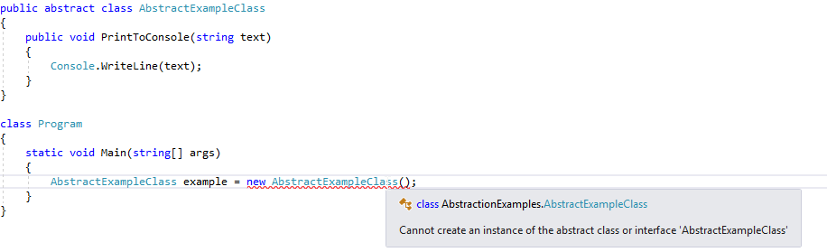
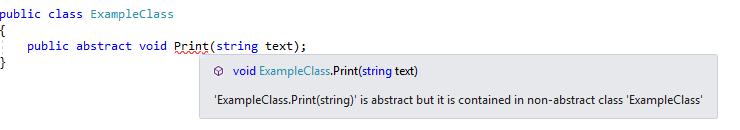
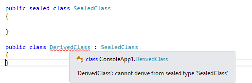

[![Github][github-shield]][github-url]
[![Kofi][kofi-shield]][kofi-url]
[![LinkedIn][linkedin-shield]][linkedin-url]

# CLASES ABSTRACTAS

## Crear clases abstractas

Para crear una clase abstracta, usamos la palabra clave `abstract`. El único propósito de la clase abstracta es heredarse y no se puede instanciar:



Una clase abstracta puede contener métodos abstractos. Un método abstracto no contiene implementación, solo una definición con la palabra clave `abstract`:

```csharp
public abstract void Print(string text);
```

Para implementar un método abstracto en la clase que deriva de una clase abstracta, necesitamos usar la palabra clave `override`:

```csharp
public override void Print()
{
    //method implementation
}
```

Como pudimos ver en una imagen anterior, una clase abstracta no tiene que tener ningún miembro abstracto, pero lo más importante es que si una clase tiene al menos un miembro abstracto, esa clase debe ser una clase abstracta. De lo contrario, el compilador informará un error:



## Clases Selladas

Si queremos evitar que se herede nuestra clase, necesitamos usar la palabra clave `sealed`. Si alguien intenta usar una clase sellada como clase base, el compilador arrojará un error:



---
[Regresar al menú principal](https://github.com/FernandoCalmet/dotnet-6-essencial)

<!--- reference style links --->
[github-shield]: https://img.shields.io/badge/-@fernandocalmet-%23181717?style=flat-square&logo=github
[github-url]: https://github.com/fernandocalmet
[kofi-shield]: https://img.shields.io/badge/-@fernandocalmet-%231DA1F2?style=flat-square&logo=kofi&logoColor=ff5f5f
[kofi-url]: https://ko-fi.com/fernandocalmet
[linkedin-shield]: https://img.shields.io/badge/-fernandocalmet-blue?style=flat-square&logo=Linkedin&logoColor=white&link=https://www.linkedin.com/in/fernandocalmet
[linkedin-url]: https://www.linkedin.com/in/fernandocalmet