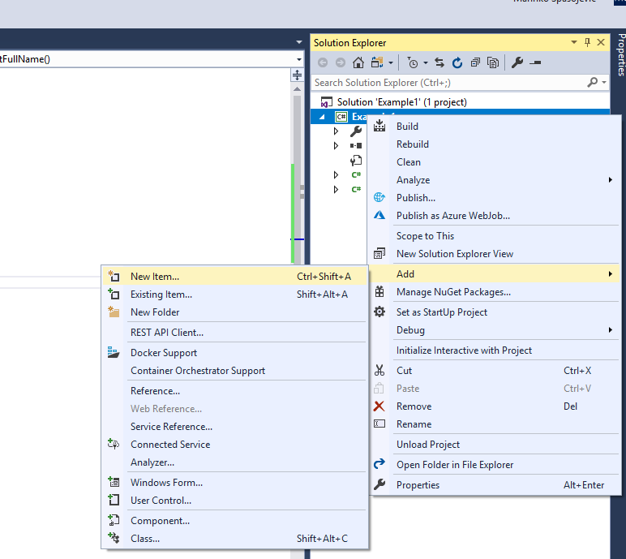
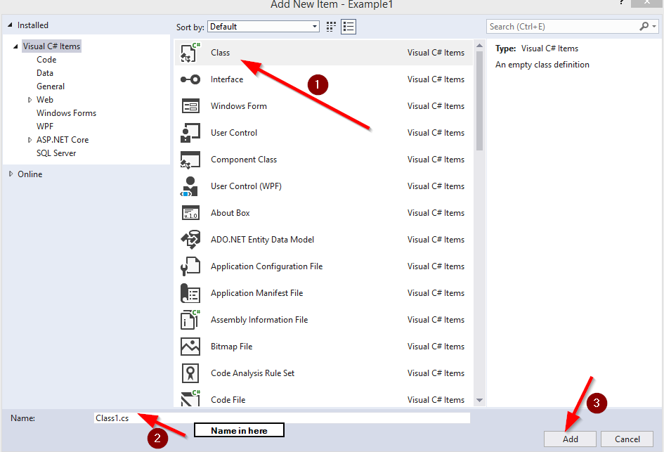

[![Github][github-shield]][github-url]
[![Kofi][kofi-shield]][kofi-url]
[![LinkedIn][linkedin-shield]][linkedin-url]

# CLASES Y CONSTRUCTORES

## Agregar nuevos elementos en el Explorador de soluciones

Aunque podemos crear nuevas clases dentro del archivo `Program.cs`, es mucho mejor crear una nueva clase en un archivo separado. Para hacer eso, necesitamos hacer clic derecho en el nombre de nuestro proyecto, elegir Agregar y luego Nuevo elemento (Ctrl + Shift + A):



Luego, debemos elegir un archivo de clase y agregarle un nombre:



## Definición de clases y cómo utilizarlas

En C #, para definir una clase, necesitamos usar la palabra clave `class`. La clase consta de miembros. Todos los miembros de la clase se definen en el cuerpo de la clase entre dos llaves:

```csharp
public class Student
{
    private string _name;
    private string _lastName;

    public string GetFullName()
    {
        return _name + ' ' + _lastName;
    }
 }
```

Vemos que el cuerpo contiene dos campos privados (las variables en el cuerpo de la clase se llaman campos) `_name` y `_lastName` un método público `GetFullName` (si no está familiarizado con los modificadores de acceso: privado, público, etc.).

Como sabemos por nuestros conceptos básicos de C # del módulo 1, la clase es un tipo de referencia, por lo que para inicializarla necesitamos usar la palabra clave `new`:

```csharp
class Program
{
    static void Main(string[] args)
    {
        Student student = new Student();
    }
}
```

Ahora el objeto `student` puede acceder a los miembros de la clase `Student`. Por ahora, solo tenemos un método dentro de la clase `Student` y podemos llamarlo con la sintaxis `student.GetFullName()`. Esto devolverá una cadena vacia, pero lo arreglaremos tan pronto como introduzcamos los constructores.

Es muy importante no confundir los términos clase y objeto. La clase es una definición de tipo, pero un objeto es una instancia de ese tipo. Podemos tener varias instancias de objetos de la misma clase:

```csharp
Student student = new Student();
Student student10 = new Student();
Student student20 = new Student();
Student student30 = new Student();
```

## Constructores

Cuando usamos la palabra clave `new` para crear un objeto, CLR (Common Language Runtime) usa la definición de clase para construir ese objeto por nosotros llamando a un método constructor.

El constructor es un método especial que tiene el mismo nombre que la clase en la que está definido, no devuelve ningún valor (ni siquiera vacío) y puede tomar parámetros. Se ejecuta automáticamente cuando creamos una instancia de una clase. Entonces, cada vez que usamos la palabra clave `new` para crear una instancia de una clase, estamos llamando a un constructor de esa clase.

Cada clase debe tener un constructor. Si no escribimos uno, el compilador genera uno automáticamente para nosotros. Este tipo de constructor se denomina constructor predeterminado . Un constructor predeterminado establecerá todos los datos dentro de una clase, a sus valores predeterminados (valores asignados si no los asignamos). Entonces, en nuestro ejemplo, los campos `_name` y `_lastName` tendrán una cadena vacia como valor al principio.

También podemos escribir nuestro propio constructor predeterminado:

```csharp
public class Student
{
    private string _name;
    private string _lastName;

    public Student()
    {
        _name = string.Empty;
        _lastName = string.Empty;
    }

    public string GetFullName()
    {
        return _name + ' ' + _lastName;
    }
}
```

## Sobrecarga del constructor

Nuestras clases no están restringidas a tener un solo método constructor. Podemos crear más de ellos en una sola clase:

```csharp
public class Student
{
    private string _name;
    private string _lastName;

    public Student()
    {
        _name = string.Empty;
        _lastName = string.Empty;
    }

    public Student(string name, string lastName)
    {
        _name = name;
        _lastName = lastName;
    }

    public string GetFullName()
    {
        return _name + ' ' + _lastName;
    }
}
```

Ahora tenemos dos opciones para instanciar nuestra clase, la primera con los valores predeterminados (que no tenemos que escribir) y la sobrecargada, que nos da la posibilidad de establecer los valores de nuestros campos:

```csharp
class Program
{
    static void Main(string[] args)
    {
        Student student = new Student(); //default constructor

        Student student1 = new Student("John", "Doe");//overloaded constructor
        Console.WriteLine(student1.GetFullName());
    }
}
```

Hay una cosa importante a tener en cuenta. Si creamos nuestro propio constructor para una clase, el compilador no creará uno predeterminado para nosotros. Entonces, si queremos tener uno predeterminado y el sobrecargado, debemos crear ambos.

## Clases parciales

En un proyecto del mundo real, nuestra clase puede ser bastante grande con tantas líneas de código. Ese tipo de clases podrían volverse menos legibles y difíciles de mantener. Para evitar eso, podemos usar clases parciales. Las clases parciales tienen aún más ventajas porque varios desarrolladores pueden trabajar en la misma clase al mismo tiempo. Además, también podemos crear un método parcial dentro de esas clases.

Una clase parcial no es más que una parte de una sola clase. Para definir clases parciales, necesitamos usar la palabra clave `partial` en cada archivo:

```csharp
partial class Student
{
    private string _name;
    private string _lastName;

    public Student()
    {
        _name = string.Empty;
        _lastName = string.Empty;
    }
}

partial class Student
{
    public Student(string name, string lastName)
    {
        _name = name;
        _lastName = lastName;
    }

    public string GetFullName()
    {
        return _name + ' ' + _lastName;
    }
}
```

---
[Regresar al menú principal](https://github.com/FernandoCalmet/dotnet-6-essencial)

<!--- reference style links --->
[github-shield]: https://img.shields.io/badge/-@fernandocalmet-%23181717?style=flat-square&logo=github
[github-url]: https://github.com/fernandocalmet
[kofi-shield]: https://img.shields.io/badge/-@fernandocalmet-%231DA1F2?style=flat-square&logo=kofi&logoColor=ff5f5f
[kofi-url]: https://ko-fi.com/fernandocalmet
[linkedin-shield]: https://img.shields.io/badge/-fernandocalmet-blue?style=flat-square&logo=Linkedin&logoColor=white&link=https://www.linkedin.com/in/fernandocalmet
[linkedin-url]: https://www.linkedin.com/in/fernandocalmet