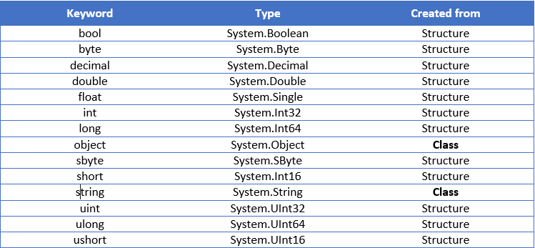

[![Github][github-shield]][github-url]
[![Kofi][kofi-shield]][kofi-url]
[![LinkedIn][linkedin-shield]][linkedin-url]

# ESTRUCTURAS

## Trabajar con estructuras

Una estructura es un tipo de valor, lo opuesto a una clase que es un tipo de referencia, y tiene sus propios campos, métodos y constructores como una clase.

Int, double, decimal, bool type, etc.son todos alias para las estructuras System.Int32, System.Int64, etc. En una tabla a continuación, podemos ver los tipos primitivos y de qué se construyen (clase o estructura):



## Declaración de estructura

Para declarar nuestra propia estructura, necesitamos usar la palabra clave `struct` seguida del nombre del tipo y luego el cuerpo de la estructura entre dos llaves:

```csharp
public struct Time
{
    private int _hours, _minutes, _seconds;
}
```

Podemos crear nuestro propio constructor para inicializar nuestros campos privados:

```csharp
public struct Time
{
    private int _hours, _minutes, _seconds;

    public Time(int hours, int minutes, int seconds)
    {
        _hours = hours;
        _minutes = minutes;
        _seconds = seconds;
    }

    public void PrintTime()
    {
        Console.WriteLine($"Hours: {_hours}, Minutes: {_minutes}, Seconds: {_seconds}");
    }
}
```

Para acceder a nuestra estructura podemos usar esta sintaxis:

```csharp
static void Main(string[] args)
{
    Time time = new Time(3, 30, 25);
    time.PrintTime();

    Console.ReadKey();
}
```

## Diferencias entre clases y estructuras

- La estructura es un tipo de valor, mientras que la clase es un tipo de referencia.
- No podemos declarar nuestro propio constructor predeterminado en una estructura. Eso es porque una estructura siempre genera un constructor predeterminado para nosotros. En una clase, nos podemos crear un constructor por defecto debido a una clase no generará entonces una para nosotros
- Podemos inicializar campos en nuestra estructura creando un constructor no predeterminado, pero debemos inicializar todos los campos dentro de ese constructor. 

No está permitido dejar un solo campo sin un valor:


Con una clase, esto no es un caso

- En una clase, podemos inicializar campos de instancia en su punto de declaración. En una estructura, no podemos hacer eso:


- Una instancia de una clase vive en una memoria de pila mientras que la instancia de una estructura vive en una pila
- En una estructura, podemos crear un constructor no predeterminado, pero sin embargo, el compilador siempre generará el predeterminado. Este no es el caso de una clase.

## Cuándo usar la estructura en lugar de una clase

La regla general que podemos seguir es que nuestras estructuras deben ser tipos pequeños y simples y sobre todo inmutables. Para cualquier otra cosa, deberíamos usar una clase.

> ¿Por qué es tan importante la inmutabilidad?

Bueno, echemos un vistazo a este ejemplo:

```csharp
class Test
{
    public int Number { get; set; }

    public Test(int number)
    {
        Number = number;
    }
}```

```csharp
class Program
{
    static void Main(string[] args)
    {
        Test test = new Test(10);
        Console.WriteLine(test.Number);

        ChangeNumber(test);
        Console.WriteLine(test.Number);
    }

    public static void ChangeNumber(Test test)
    {
        test.Number = 45;
    }
}
```

Si inspeccionamos el resultado, veremos impresos 10 y 45. Y ese es el resultado correcto. Pero si cambiamos nuestra clase de prueba para que sea una estructura y luego inspeccionamos el resultado, veremos 10 y 10.
Esto puede generar confusión y problemas también, porque el consumidor puede esperar que el método `ChangeNumber` modifique la propiedad `Number` porque lo permitimos en el código. Pero si creamos propiedades o campos de manera inmutable (como de solo lectura en una estructura), entonces podemos evitar este tipo de confusión. El consumidor puede asignar valores a las propiedades llamando al método constructor, pero luego esas propiedades deben permanecer inmutables.

---
[Regresar al menú principal](https://github.com/FernandoCalmet/dotnet-6-essencial)

<!--- reference style links --->
[github-shield]: https://img.shields.io/badge/-@fernandocalmet-%23181717?style=flat-square&logo=github
[github-url]: https://github.com/fernandocalmet
[kofi-shield]: https://img.shields.io/badge/-@fernandocalmet-%231DA1F2?style=flat-square&logo=kofi&logoColor=ff5f5f
[kofi-url]: https://ko-fi.com/fernandocalmet
[linkedin-shield]: https://img.shields.io/badge/-fernandocalmet-blue?style=flat-square&logo=Linkedin&logoColor=white&link=https://www.linkedin.com/in/fernandocalmet
[linkedin-url]: https://www.linkedin.com/in/fernandocalmet