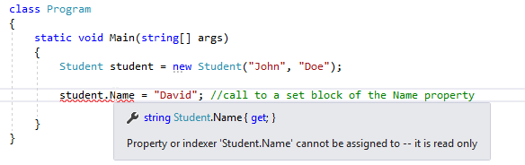
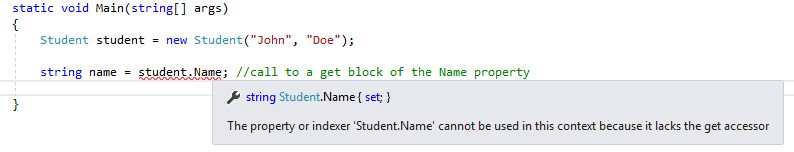
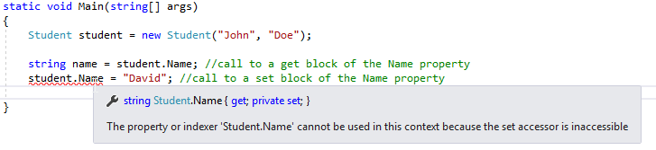
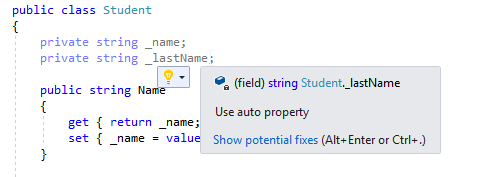

[![Github][github-shield]][github-url]
[![Kofi][kofi-shield]][kofi-url]
[![LinkedIn][linkedin-shield]][linkedin-url]

# PROPIEDADES

## Sintaxis de propiedad

La sintaxis de una declaración de propiedad se puede utilizar de la siguiente manera:

```csharp
Modificador_Acceso Tipo NombrePropiedad
{
    get
    {
        //leer acciones
    }
    set
    {
        //escribir acciones
    }
}
```

Como podemos ver, una propiedad puede contener dos bloques de código. El bloque `get` contiene declaraciones que se ejecutan cuando leemos de una propiedad. El bloque `set` contiene declaraciones que se ejecutan cuando escribimos en una propiedad:

```csharp
public class Estudiante
{
    private string _nombre;
    private string _apellido;

    public string Nombre
    {
        get { return _nombre; }
        set { _nombre = value; }
    }

    public string Apellido
    {
        get { return _apellido; }
        set { _apellido = value; }
    }

    public Estudiante(string nombre, string apellido)
    {
        _nombre = nombre;
        _apellido = apellido;
    }

    public string ObtenerNombreCompleto()
    {
        return _nombre + ' ' + _apellido;
    }
}
```

En el ejemplo anterior, vemos que nuestros campos privados ahora están expuestos a través de las propiedades. Si queremos leer el valor del campo `_nombre`, todo lo que tenemos que hacer es llamar a la propiedad `Nombre` con el objeto `estudiante`. Lo mismo se aplica al campo `_apellido`. Además, si queremos establecer un valor para nuestros campos, todo lo que tenemos que hacer es llamar a un bloque de conjunto de nuestras propiedades:

```csharp
class Program
{
    static void Main(string[] args)
    {
        Estudiante estudiante = new Estudiante("John", "Doe");

        string nombre = estudiante.Nombre; //llamada a un bloque get de la propiedad Nombre
        string apellido = estudiante.Apellido; //llamada a un bloque get de la propiedad Apellido

        estudiante.Nombre = "David"; //llamada a un bloque set de la propiedad Nombre
        estudiante.Apellido = "Dauni"; //llamada a un bloque set de la propiedad Apellido
    }
}
```

Nuestras propiedades pueden tener un código complejo dentro de bloques `get` o `set`. No se limitan solo a leer un valor o simplemente a escribir un valor. Podemos usar condiciones o llamadas a métodos, etc.en los bloques `get` o `set`:

```csharp
public int X
{
    get 
    {
        return _x;
    }
    set
    {
        _x = ComprobarValor(value);
    }
}    

private int ComprobarValor(int val)
{
    //ejecución de código aquí
}
```

## Propiedades de solo lectura y solo escritura

Podemos declarar una propiedad que solo tiene un bloque `get` y no el `set`. Ese tipo de propiedad se denomina propiedad de solo lectura. Si creamos una propiedad de solo lectura, solo podemos leer el valor de un campo privado. Es bastante común crear una propiedad de solo lectura dentro de nuestra clase. Lo que queremos con él es establecerlo con el método constructor y luego usar su valor en toda la clase, pero nunca establecer su valor fuera del constructor . Si intentamos configurarlo, el compilador arrojará un error:

```csharp
public string Nombre
{
    get { return _nombre; }
}
```



De la misma manera, como podemos crear una propiedad de solo lectura, podemos crear una propiedad de solo escritura. Ese tipo de propiedad solo tiene el bloque set y no el get. No es un caso común crear propiedades de solo escritura. Eso sí, si lo necesitamos, solo podemos establecer los valores con este tipo de propiedad y no leerlo:

```csharp
public string Nombre
{
    set { _nombre = value; }
}
```



## Accesibilidad de la propiedad

Podemos especificar un modificador de acceso para nuestra propiedad (pública, privada) si queremos restringir su disponibilidad. Pero en C# incluso podemos anular la accesibilidad de los accesos get o set. Entonces, lo que podemos hacer es declarar una propiedad pública que tiene el acceso público get y el acceso privado set. Si nuestra propiedad es pública, no tenemos que agregar la palabra clave pública para el descriptor de acceso get, será pública de todos modos:

```csharp
public string Nombre
{
     get { return _nombre; }
     private set { _nombre = value; }
} 
```



Esto significa que podemos leer en todas las clases de nuestra propiedad Nombre, pero podemos configurarla solo dentro de la clase `Estudiante`.

Cuando usamos un descriptor de acceso que sobrescribe dentro de la propiedad, debemos prestar atención a las siguientes reglas:

- Podemos cambiar el nivel de accesibilidad de un solo acceso. No tiene sentido modificar ambos accesos. Si queremos modificar ambos accesos, simplemente deberíamos modificar el nivel de acceso a la propiedad.
- No podemos usar el modificador de acceso en los bloques get o set que son menos restrictivos del modificador de acceso aplicado en una propiedad en sí. Entonces, si nuestra propiedad es privada, no tiene sentido que el público obtenga o establezca un bloqueo.

## Propiedades implementadas automáticamente

Si no se requiere lógica adicional en un descriptor de acceso de propiedad, podemos usar las propiedades implementadas automáticamente para una forma más legible y concisa de declarar propiedades. La propiedad implementada automáticamente consta solo de las palabras clave get y set, nada más:

```csharp
public string Nombre { get; set; }
public string Apellido { get; set; }
```

Cuando declaramos las propiedades de esta manera, el compilador crea un campo privado para nosotros, al que solo se puede acceder a través de los descriptores de acceso get o set de la propiedad.

Entonces en nuestro ejemplo en lugar de:

```csharp
private string _nombre;

public string Nombre
{
    get { return _nombre; }
    set { _nombre = value; }
}
```

Podemos simplemente escribir:

```csharp
public string Nombre { get; set; }
```

En Visual Studio, incluso vamos a recibir una sugerencia para usar una propiedad automática:



---
[Regresar al menú principal](https://github.com/FernandoCalmet/dotnet-6-essencial)

<!--- reference style links --->
[github-shield]: https://img.shields.io/badge/-@fernandocalmet-%23181717?style=flat-square&logo=github
[github-url]: https://github.com/fernandocalmet
[kofi-shield]: https://img.shields.io/badge/-@fernandocalmet-%231DA1F2?style=flat-square&logo=kofi&logoColor=ff5f5f
[kofi-url]: https://ko-fi.com/fernandocalmet
[linkedin-shield]: https://img.shields.io/badge/-fernandocalmet-blue?style=flat-square&logo=Linkedin&logoColor=white&link=https://www.linkedin.com/in/fernandocalmet
[linkedin-url]: https://www.linkedin.com/in/fernandocalmet