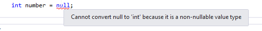

[![Github][github-shield]][github-url]
[![Kofi][kofi-shield]][kofi-url]
[![LinkedIn][linkedin-shield]][linkedin-url]

# TIPOS ANÓNIMOS Y QUE ACEPTAN VALORES NULL

## Clases anónimas

Una clase anónima es una clase que no tiene nombre. Esto suena extraño, pero a veces una clase anónima puede ser útil, especialmente cuando se usan expresiones de consulta.

Veamos qué queremos decir con eso.

Podemos crear un objeto de la clase anónima simplemente usando la palabra clave `new` delante de llaves:

```csharp
miObjetoAnonimo = new { Nombre = "Fernando", Edad = 32 };
```

Este objeto contiene dos propiedades el `Nombre` y el `Edad`. El compilador asignará implícitamente los tipos a las propiedades en función de los tipos de sus valores. Entonces, lo que esto significa básicamente es que la propiedad `Nombre` será del tipo cadena y la propiedad `Edad` del tipo int.

Pero ahora, podemos preguntarnos, ¿de qué tipo `miObjetoAnonimo` es? Y la respuesta es que no sabemos, cuál es el objetivo de las clases anónimas. Pero en C # esto no es un problema, podemos declarar nuestro objeto como una variable tipada implícitamente usando la palabra clave `var`:

```csharp
var miObjetoAnonimo = new { Nombre = "Fernando", Edad = 32 };
```

La palabra clave var hace que el compilador cree una variable del mismo tipo que la expresión que usamos para inicializar ese objeto. Entonces, veamos un par de ejemplos de tipos conocidos:

```csharp
var numero = 15; //el numero es de tipo int
var palabra = "ejemplo"; //la palabra es de tipo string
var dinero = 987.32; //el dinero es de tipo double
```

Podemos acceder a las propiedades de nuestro objeto anónimo de la misma manera que lo hicimos con los objetos regulares:

```csharp
Console.WriteLine($"El nombre de mi objeto anonimo es {miObjetoAnonimo.Nombre}, y su edad es {miObjetoAnonimo.Edad}");
```

## Tipos que aceptan valores NULL

El valor nulo es útil para inicializar tipos de referencia. Entonces, es lógico que no podamos asignar el valor nulo al tipo de valor porque el nulo es en sí mismo una referencia.

Dicho esto, podemos ver que la siguiente declaración arrojará un error:



Sin embargo, C# nos proporciona un modificador que podemos usar para declarar un tipo de valor como un tipo de valor anulable. Podemos usar el `?` signo para indicar que el tipo de valor es anulable:

```csharp
int? numero = null;
```

Todavía podemos asignar un valor entero a nuestro tipo de valor anulable:

```csharp
int? numero = null;
int otroNumero = 200;

numero = 345;
numero = otroNumero;
```

Todo esto es válido. Pero si intentamos asignar la variable de un tipo int con un valor de nuestro tipo anulable, vamos a tener un problema:

```csharp
int? numero = null;
int otroNumero = 200;

otroNumero = numero; //este es el problema
```

Esto tiene sentido si consideramos que la variable `numero` puede contener el nulo pero la variable `otroNumero` no puede contener nulo en absoluto.

## Propiedades de los tipos que aceptan valores NULL

Los tipos que aceptan valores NULL exponen algunas propiedades que pueden resultar útiles mientras se trabaja en nuestros proyectos. La propiedad `HasValue` indica si un tipo que acepta valores NULL contiene un valor o es un valor nulo. La propiedad `Value` nos permite recuperar el valor del tipo que acepta valores NULL si no es nulo:

```csharp
int? numero = null;
numero = 234; //comentar esta línea para imprimir el resultado del bloque else

if(numero.HasValue)
{
    Console.WriteLine(numero.Value);
}
else
{
     Console.WriteLine("numero es nulo");
}
```

---
[Regresar al menú principal](https://github.com/FernandoCalmet/dotnet-6-essencial)

<!--- reference style links --->
[github-shield]: https://img.shields.io/badge/-@fernandocalmet-%23181717?style=flat-square&logo=github
[github-url]: https://github.com/fernandocalmet
[kofi-shield]: https://img.shields.io/badge/-@fernandocalmet-%231DA1F2?style=flat-square&logo=kofi&logoColor=ff5f5f
[kofi-url]: https://ko-fi.com/fernandocalmet
[linkedin-shield]: https://img.shields.io/badge/-fernandocalmet-blue?style=flat-square&logo=Linkedin&logoColor=white&link=https://www.linkedin.com/in/fernandocalmet
[linkedin-url]: https://www.linkedin.com/in/fernandocalmet